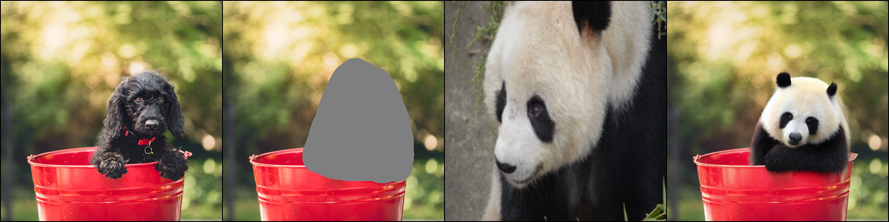
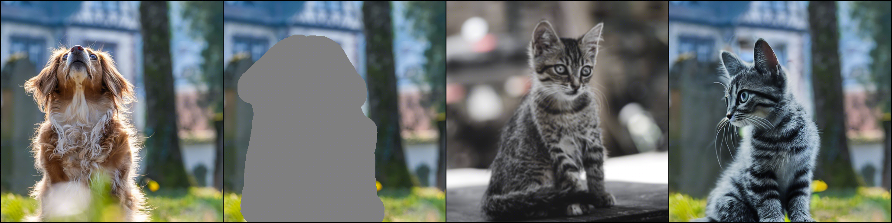
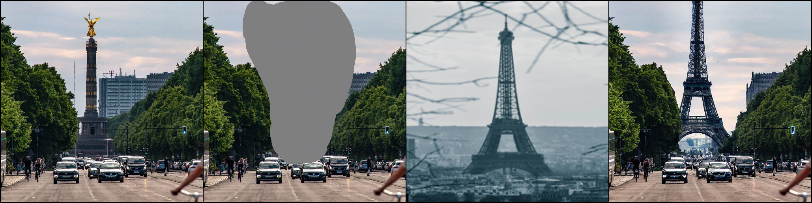

# Paint by Example: Exemplar-based Image Editing with Diffusion Models

### [Paper](https://arxiv.org/abs/2211.13227) | [Huggingface Demo](https://huggingface.co/spaces/Fantasy-Studio/Paint-by-Example) 
<!-- <br> -->
[Binxin Yang](https://orcid.org/0000-0003-4110-1986), [Shuyang Gu](http://home.ustc.edu.cn/~gsy777/), [Bo Zhang](https://bo-zhang.me/), [Ting Zhang](https://www.microsoft.com/en-us/research/people/tinzhan/), [Xuejin Chen](http://staff.ustc.edu.cn/~xjchen99/), [Xiaoyan Sun](http://staff.ustc.edu.cn/~xysun720/), [Dong Chen](https://www.microsoft.com/en-us/research/people/doch/) and [Fang Wen](https://www.microsoft.com/en-us/research/people/fangwen/).
<!-- <br> -->

## Abstract
>Language-guided image editing has achieved great success recently. In this paper, for the first time, we investigate exemplar-guided image editing for more precise control. We achieve this goal by leveraging self-supervised training to disentangle and re-organize the source image and the exemplar. However, the naive approach will cause obvious fusing artifacts. We carefully analyze it and propose an information bottleneck and strong augmentations to avoid the trivial solution of directly copying and pasting the exemplar image. Meanwhile, to ensure the controllability of the editing process, we design an arbitrary shape mask for the exemplar image and leverage the classifier-free guidance to increase the similarity to the exemplar image. The whole framework involves a single forward of the diffusion model without any iterative optimization. We demonstrate that our method achieves an impressive performance and enables controllable editing on in-the-wild images with high fidelity.
>
## News

- *2022-11-29* Upload code.
- *2022-12-07* Release a [Gradio](https://gradio.app/) demo on [Hugging Face](https://huggingface.co/spaces/Fantasy-Studio/Paint-by-Example) Spaces.

## Requirements
A suitable [conda](https://conda.io/) environment named `Paint-by-Example` can be created
and activated with:

```
conda env create -f environment.yaml
conda activate Paint-by-Example
```

## Pretrained Model
We provide the checkpoint ([Google Drive](https://drive.google.com/file/d/15QzaTWsvZonJcXsNv-ilMRCYaQLhzR_i/view?usp=share_link) | [Hugging Face](https://huggingface.co/Fantasy-Studio/Paint-by-Example/resolve/main/model.ckpt)) that is trained on [Open-Images](https://storage.googleapis.com/openimages/web/index.html) for 40 epochs. By default, we assume that the pretrained model is downloaded and saved to the directory `checkpoints`.

## Testing

To sample from our model, you can use `scripts/inference.py`. For example, 
```
python scripts/inference.py \
--plms --outdir results \
--config configs/v1.yaml \
--ckpt checkpoints/model.ckpt \
--image_path examples/image/example_1.png \
--mask_path examples/mask/example_1.png \
--reference_path examples/reference/example_1.jpg \
--seed 321 \
--scale 5
```
or simply run:
```
sh test.sh
```
Visualization of inputs and output:





## Training

### Data preparing
- Download separate packed files of Open-Images dataset from [CVDF's site](https://github.com/cvdfoundation/open-images-dataset#download-images-with-bounding-boxes-annotations) and unzip them to the directory `dataset/open-images/images`.
- Download bbox annotations of Open-Images dataset from [Open-Images official site](https://storage.googleapis.com/openimages/web/download_v7.html#download-manually) and save them to the directory `dataset/open-images/annotations`.
- Generate bbox annotations of each image in txt format.
    ```
    python scripts/read_bbox.py
    ```

The data structure is like this:
```
dataset
├── open-images
│  ├── annotations
│  │  ├── class-descriptions-boxable.csv
│  │  ├── oidv6-train-annotations-bbox.csv
│  │  ├── test-annotations-bbox.csv
│  │  ├── validation-annotations-bbox.csv
│  ├── images
│  │  ├── train_0
│  │  │  ├── xxx.jpg
│  │  │  ├── ...
│  │  ├── train_1
│  │  ├── ...
│  │  ├── validation
│  │  ├── test
│  ├── bbox
│  │  ├── train_0
│  │  │  ├── xxx.txt
│  │  │  ├── ...
│  │  ├── train_1
│  │  ├── ...
│  │  ├── validation
│  │  ├── test
```

### Download the pretrained model of Stable Diffusion
We utilize the pretrained Stable Diffusion v1-4 as initialization, please download the pretrained models from [Hugging Face](https://huggingface.co/CompVis/stable-diffusion-v-1-4-original) and save the model to directory `pretrained_models`. Then run the following script to add zero-initialized weights for 5 additional input channels of the UNet (4 for the encoded masked-image and 1 for the mask itself).
```
python scripts/modify_checkpoints.py
```

### Training Paint by Example
To train a new model on Open-Images, you can use `main.py`. For example,
```
python -u main.py \
--logdir models/Paint-by-Example \
--pretrained_model pretrained_models/sd-v1-4-modified-9channel.ckpt \
--base configs/v1.yaml \
--scale_lr False
```
or simply run:
```
sh train.sh
```
## Citing Paint by Example

```
@article{yang2022paint,
  title={Paint by Example: Exemplar-based Image Editing with Diffusion Models},
  author={Binxin Yang and Shuyang Gu and Bo Zhang and Ting Zhang and Xuejin Chen and Xiaoyan Sun and Dong Chen and Fang Wen},
  journal={arXiv preprint arXiv:2211.13227},
  year={2022}
}
```

## Acknowledgements

This code borrows heavily from [Stable Diffusion](https://github.com/CompVis/stable-diffusion). We also thank the contributors of [OpenAI's ADM codebase](https://github.com/openai/guided-diffusion) and [https://github.com/lucidrains/denoising-diffusion-pytorch](https://github.com/lucidrains/denoising-diffusion-pytorch).

## Maintenance

Please open a GitHub issue for any help. If you have any questions regarding the technical details, feel free to contact us.

## License
The codes and the pretrained model in this repository are under the CreativeML OpenRAIL M license as specified by the LICENSE file.
